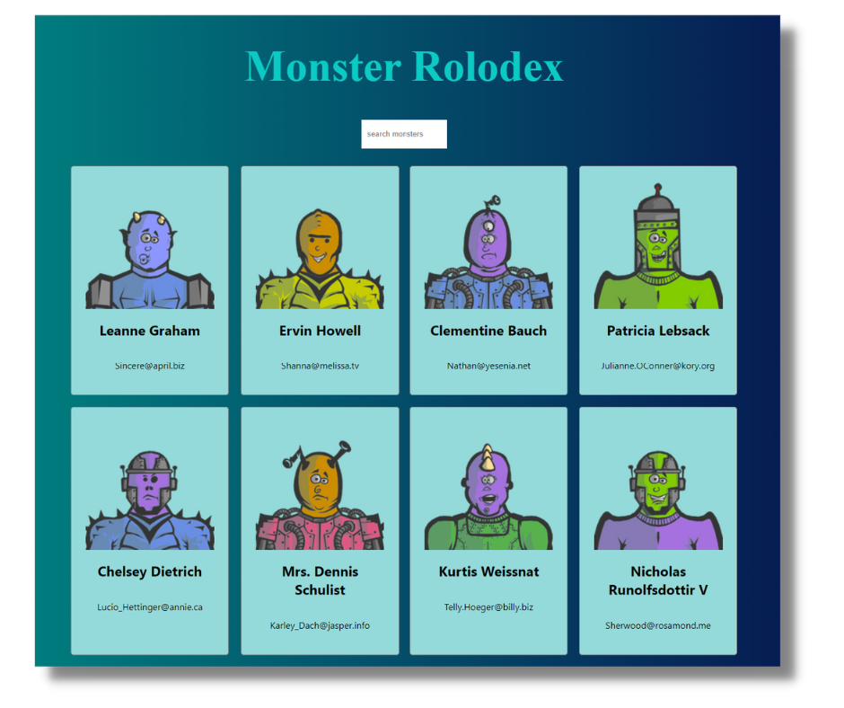

# Monsters Rolodex

### Links
- Live Site URL: [https://monster-rolodex-pperdana.netlify.app](https://monster-rolodex-pperdana.netlify.app)

## Table of contents
 
  - [Overview](#overview)
    - [The challenge](#the-challenge)
    - [Screenshot](#screenshot)
  - [Tech stack](#tech-stack)
  - [Author](#author)
  

## Overview

### The challenge

- View the optimal layout for the interface depending on their device's screen size
- Display list of monsters from robohash
- Search monsters base on name or keywords

### Screenshot

## Tech stack
- React
- CSS
- API
- Semantic HTML5 markup
- Mobile-first workflow
- Flexbox
- Grid

## Author

- Website - [pperdana.netlify.app](https://pperdana.netlify.app)
- Frontend Mentor - [@Panji200](https://www.frontendmentor.io/profile/Panji200)
